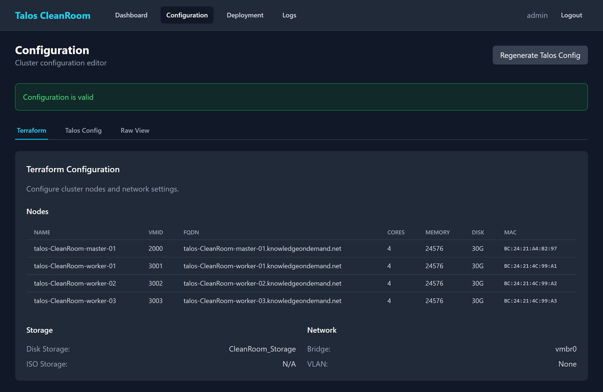

# Configuration

The Configuration page lets you review and edit the cluster settings that control how your infrastructure is deployed.

## Accessing Configuration

Click **Configuration** in the Deployment Console navigation bar.

## Tabs

The page is organized into tabs:

### Terraform Tab

Shows the infrastructure settings that Terraform uses to create virtual machines:

{ width="720" }

- **Nodes Table** — lists each virtual machine with its name, VMID (identifier in Proxmox), FQDN (full domain name), CPU cores, memory, disk size, and MAC address
- **Storage Settings** — disk configuration for the VMs
- **Network Settings** — VLAN, gateway, and subnet configuration

### Talos Tab

Shows the Talos Linux and Kubernetes cluster settings:

{ width="720" }

- **Cluster name** and **endpoint** (the control plane address)
- **Talos version** and **Kubernetes version**
- **Environment variables** used during configuration generation

### Raw View Tab

Shows the full configuration files in their original format. This is mainly useful for advanced troubleshooting.

## Validation

At the top of the page, you will see a validation status:

- **Valid** (green) — configuration is correct and deployment can proceed
- **Errors** (red) — lists specific issues that must be fixed before deploying

{ width="720" }

!!! warning "Configuration changes"
    Changes to the configuration take effect on the **next** deployment. If a deployment is already running, changing the configuration will not affect it.

## What's Next?

- [Running a Deployment](running-deployment.md) — start deploying with your current configuration
- [Dashboard](dashboard.md) — check overall status
