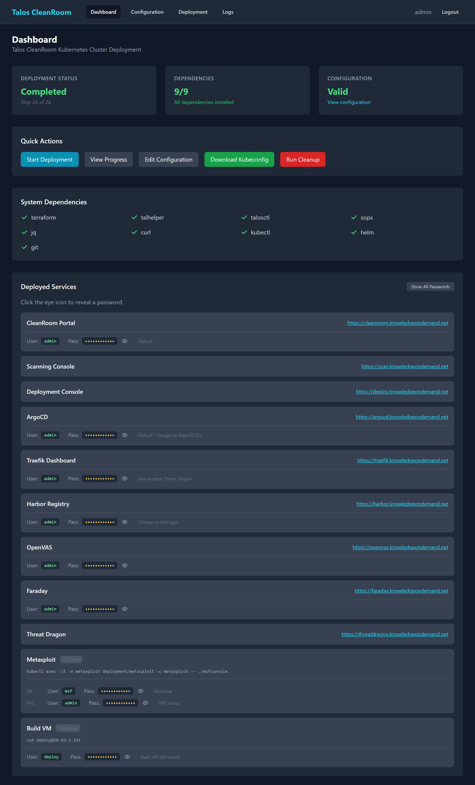

# Dashboard

The Dashboard is the home page of the Deployment Console. It gives you an at-a-glance view of the platform's status.

## Status Cards

At the top of the Dashboard, you will see three status cards:

{ width="720" }

| Card | What It Shows |
|---|---|
| **Deployment Status** | Current state: Idle (not deployed), Running (in progress), Completed (success), Failed, or Aborted |
| **Dependencies** | How many required tools are installed (e.g., "9/9"). Green means all tools are present. |
| **Configuration** | Whether the cluster configuration is valid. Shows "Valid" (green) or "Check Required" (yellow) |

## Quick Actions

Below the status cards, you will find action buttons:

- **Start Deployment** — begins the 26-step deployment process (see [Running a Deployment](running-deployment.md))
- **View Progress** — jumps to the Deployment page to watch a running deployment
- **Edit Configuration** — opens the Configuration page to review or change settings
- **Download Kubeconfig** — downloads the cluster access file (only available after a successful deployment)
- **Run Cleanup** — destroys all deployed resources and resets to idle (see [Recovery](recovery.md))

## System Dependencies

A grid shows the status of each required tool:

- Green checkmark — tool is installed and available
- Red X — tool is missing (deployment will fail until it is installed)

Required tools: Terraform, talhelper, talosctl, sops, jq, curl, kubectl, helm, git.

## Deployed Services

After a successful deployment, the bottom of the Dashboard shows all deployed services with:

- **Service name** and **URL** (clickable link to open the service)
- **Username** and **Password** for each service
- **Eye icon** to show/hide a password
- **Copy icon** to copy a password to your clipboard

!!! tip "Service credentials"
    These same credentials are also available on the [Portal Credentials page](../getting-started/credentials.md).

## What's Next?

- [Configuration](configuration.md) — review cluster settings before deploying
- [Running a Deployment](running-deployment.md) — start the deployment process
