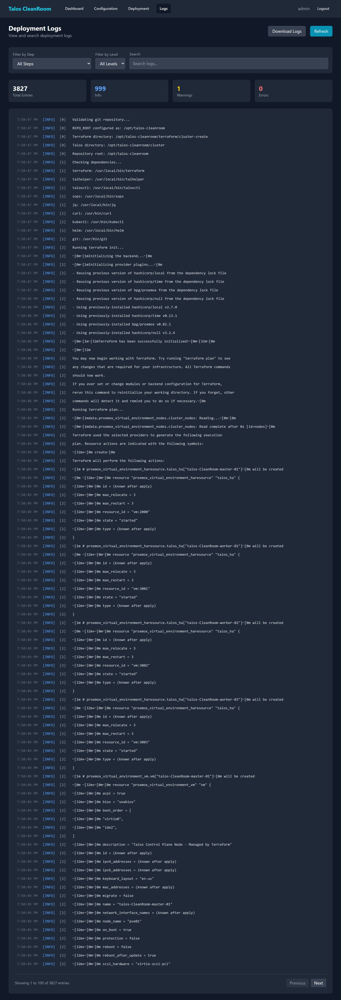

# Viewing Logs

The Logs page provides a searchable, filterable view of all deployment log entries.

## Accessing Logs

Click **Logs** in the Deployment Console navigation bar.

{ width="720" }

## Stats Cards

At the top, four cards summarize the log data:

| Card | Shows |
|---|---|
| **Total** | Total number of log entries |
| **Info** | Informational messages (normal operation) |
| **Warnings** | Non-critical issues that may need attention |
| **Errors** | Failures that require investigation |

## Filtering Logs

Use the filter controls to narrow down the log entries:

### By Step
Select a specific deployment step from the dropdown to see only logs from that step. For example, selecting "Terraform Deploy" shows only the Terraform output.

### By Level
Filter by severity:

- **Info** — normal progress messages
- **Warning** — non-critical issues
- **Error** — failures and problems

### By Search Term
Type a keyword in the search box to find specific messages. The search matches against the log message text.

## Pagination

Logs are shown in pages. Use the **Previous** and **Next** buttons at the bottom to navigate between pages.

## Downloading Logs

Click **Download Logs** to save all log entries as a file. This is useful for sharing with support or for record-keeping.

## What's Next?

- [Dashboard](dashboard.md) — return to the status overview
- [Recovery](recovery.md) — troubleshoot deployment failures
- [Troubleshooting Reference](../reference/troubleshooting.md) — common error messages and fixes
