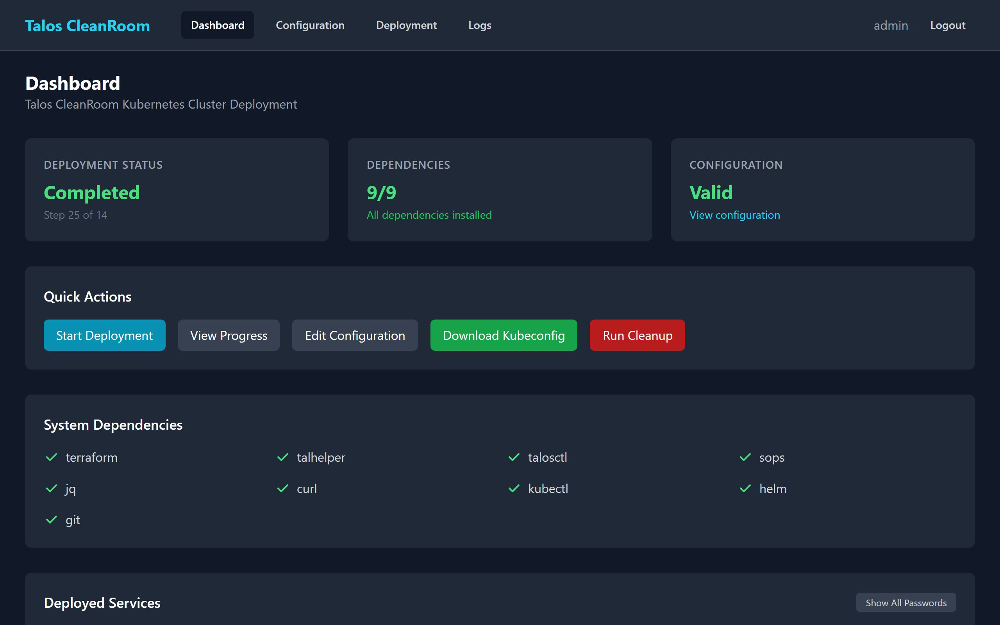

# Recovery & Troubleshooting

This page covers what to do when a deployment step fails, how to resume, and how to start fresh.

## When a Step Fails

If a deployment step encounters an error:

1. The step will show a **red X** icon with an error message
2. The deployment pauses automatically — remaining steps will not run
3. The **Resume** and **Skip** buttons become available

{ width="720" }

## Resuming a Deployment

Click **Resume** to retry from the failed step. The deployment will:

- Re-execute the failed step from the beginning
- Continue with all remaining steps if successful

!!! tip "Common transient failures"
    Network timeouts and temporary connectivity issues often resolve on their own. Resuming is usually the right first step.

## Skipping a Step

If a step keeps failing and you want to continue without it, click **Skip**. The step will be marked as "Skipped" (yellow) and the deployment continues with the next step.

!!! warning "Use skip carefully"
    Skipping a step means whatever it was supposed to do will not happen. For example, skipping "Deploy OpenVAS" means the vulnerability scanner will not be installed. Only skip a step if you understand the consequences.

## Aborting a Deployment

Click **Abort** to stop the deployment entirely. The current step will be terminated and no further steps will run. The deployment status changes to "Aborted."

After aborting, you can:

- **Resume** — restart from where you left off
- **Run Cleanup** — destroy everything and start fresh

## Running Cleanup

!!! danger "Cleanup destroys all deployed resources"
    Cleanup runs Terraform destroy to remove all virtual machines and infrastructure. This action **cannot be undone**. All data on the deployed cluster will be lost.

To run cleanup:

1. Go to the **Dashboard**
2. Click **Run Cleanup**
3. Read the confirmation dialog carefully
4. Confirm to proceed

{ width="720" }

After cleanup completes, the deployment status returns to **Idle** and you can start a fresh deployment.

## Common Issues

| Problem | Likely Cause | What to Do |
|---|---|---|
| Step 2 (Terraform) fails | Network issue or Proxmox connectivity | Check network, then Resume |
| Step 3 (Wait for VMs) times out | VMs slow to boot or wrong MAC addresses | Check VM status in Proxmox, then Resume |
| Step 5 (Apply Talos Configs) fails | Node IP not reachable | Verify network/DHCP, then Resume |
| Step 8+ (Install apps) fails | Image pull errors or Helm issues | Check cluster connectivity, then Resume |
| "Deployment already in progress" | A deployment is already running | Wait for it to finish or Abort first |

## What's Next?

- [Running a Deployment](running-deployment.md) — start or resume a deployment
- [After Deployment](post-deployment.md) — what to do after a successful deployment
- [Troubleshooting Reference](../reference/troubleshooting.md) — full error reference
