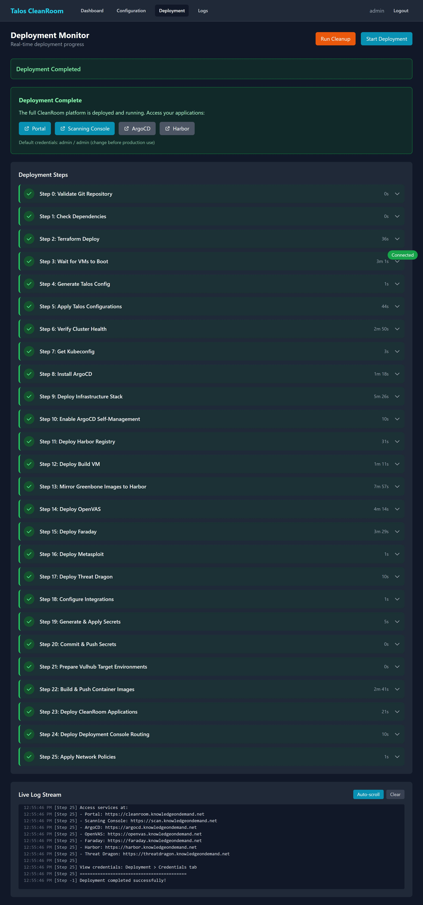

# Running a Deployment

The deployment process runs 26 automated steps to set up the entire platform — from creating virtual machines to deploying all security tools. The whole process typically takes **30 to 60 minutes**.

## Starting a Deployment

1. Go to the **Deployment** tab in the Deployment Console
2. You will see the deployment page in its idle state:

    { width="720" }

3. Click **Start Deployment**
4. Confirm when prompted

The deployment will begin immediately.

## Monitoring Progress

Once running, the page shows real-time progress:

{ width="720" }

### Step List

Each of the 26 steps is shown in the left panel with a status icon:

| Icon | Status | Meaning |
|---|---|---|
| Gray circle | **Pending** | Not started yet |
| Spinning indicator | **Running** | Currently executing |
| Green checkmark | **Success** | Completed successfully |
| Red X | **Failed** | An error occurred |
| Yellow dash | **Skipped** | Step was skipped (manually or automatically) |

Click on any step to expand it and see its logs.

### Live Log Stream

The right panel shows a scrolling log of everything happening during the deployment. The log updates in real-time as each step executes.

- **Auto-scroll** is on by default — the log stays at the bottom so you see the latest messages
- Click the scroll toggle to turn auto-scroll off if you want to read earlier messages

### Elapsed Time

The elapsed timer at the top shows how long the deployment has been running.

## When Deployment Completes

A green banner appears with links to the deployed services:

{ width="720" }

You can now:

- Click service links to open ArgoCD, Harbor, OpenVAS, Faraday, etc.
- Go to the [Dashboard](dashboard.md) to download the kubeconfig or view service credentials
- Navigate to the [Scanning Console](../scanning/vulnerability-scan.md) to start scanning

!!! note "Time expectations by step"
    Some steps are fast (seconds), while others take several minutes. Steps 2-3 (Terraform deploy + VM boot) and steps 9-17 (infrastructure and application deployment) are typically the longest. See [Deployment Steps Reference](../reference/deployment-steps.md) for details.

## What's Next?

- [Recovery](recovery.md) — what to do if a step fails
- [After Deployment](post-deployment.md) — accessing services and downloading kubeconfig
