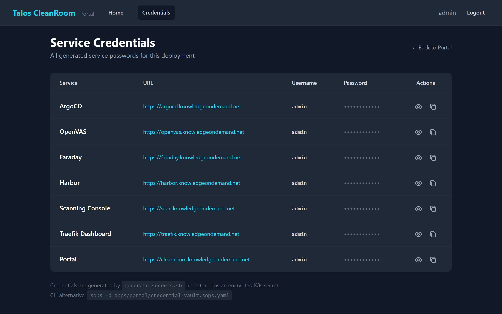

# Viewing Credentials

The Portal provides a centralized **Credentials** page where you can view usernames and passwords for all deployed services (ArgoCD, Harbor, OpenVAS, Faraday, and more).

## Accessing the Credentials Page

1. Log in to the **Portal** at `https://cleanroom.knowledgeondemand.net`
2. Click **Credentials** in the top navigation bar

You will see a table listing every service with its URL, username, and password:

{ width="720" }

## Revealing Passwords

Passwords are hidden by default (shown as dots). To reveal a password:

1. Click the **eye icon** next to the password you want to see
2. The password will appear in green text
3. Click the eye icon again to hide it

## Copying Passwords

To copy a password to your clipboard:

1. Click the **copy icon** (two overlapping squares) next to the password
2. The icon will briefly change to a green checkmark, confirming the copy
3. Paste the password wherever you need it

!!! tip "Quick access"
    The Deployment Console dashboard also shows service credentials in the "Deployed Services" section at the bottom of the page.

## Available Services

After a successful deployment, you will typically see credentials for:

| Service | What It Does |
|---|---|
| **ArgoCD** | GitOps deployment manager — manages all Kubernetes applications |
| **Harbor** | Container image registry — stores Docker images |
| **OpenVAS** | Vulnerability scanner engine — the backend that powers scans |
| **Faraday** | Vulnerability management — aggregates and tracks findings |
| **Threat Dragon** | Threat modeling tool |

## What's Next?

- [Security Basics](security.md) — change default passwords
- [Dashboard](../deployment/dashboard.md) — check deployment status
