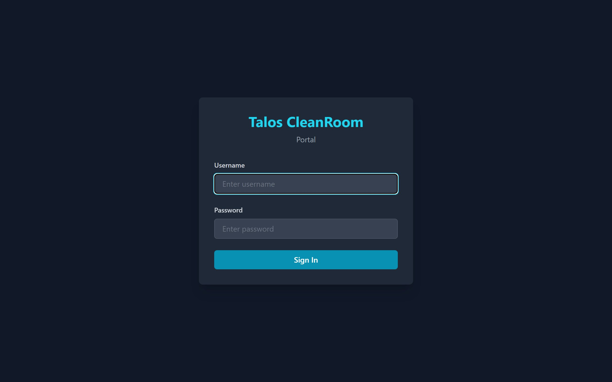
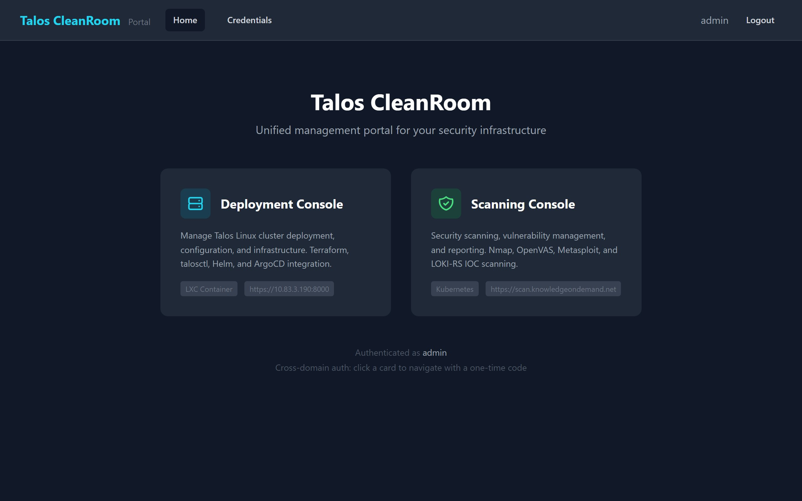

# Logging In

All access to Talos CleanRoom starts at the **Portal** — a central landing page that connects you to the other applications.

## Step-by-Step

1. Open your browser and navigate to **`https://cleanroom.knowledgeondemand.net`**
2. You will see the login screen:

    { width="720" }

3. Enter your **username** and **password** (default: `admin` / `admin`)
4. Click **Sign in**

After logging in, you will see the Portal landing page with two cards:

{ width="720" }

## Navigating to Other Apps (Single Sign-On)

When you click either card on the Portal, you are **automatically logged in** to the target application — no need to enter your password again. This works through a secure one-time code that is generated behind the scenes.

!!! tip "If the redirect fails"
    The one-time code expires after 60 seconds. If you see a login page instead of being automatically signed in, simply click the card on the Portal again.

## Direct Access (Without the Portal)

You can also go directly to each app by entering its URL in your browser:

| App | URL |
|---|---|
| Portal | `https://cleanroom.knowledgeondemand.net` |
| Deployment Console | `https://10.83.3.190:8000` |
| Scanning Console | `https://scan.knowledgeondemand.net` |

When accessing apps directly, you will need to log in with your username and password on each app separately.

## What's Next?

Learn how to navigate the platform in [Navigating the Platform](navigation.md), or jump straight to:

- [Deployment Console Dashboard](../deployment/dashboard.md) — if you need to deploy the platform
- [Vulnerability Scanning](../scanning/vulnerability-scan.md) — if you need to scan for vulnerabilities
