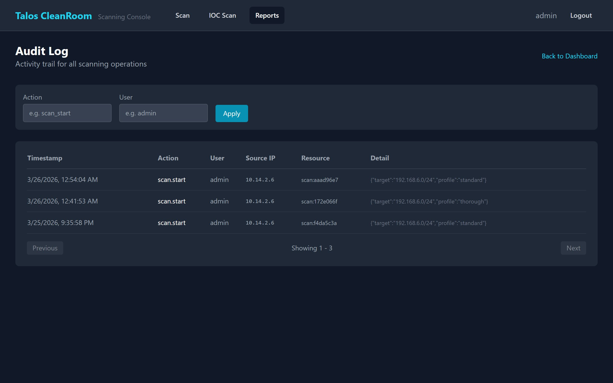

# Audit Log

The Audit Log records all significant user actions in the Scanning Console, providing a trail of who did what and when.

## Accessing the Audit Log

Go to **Reports** → **Audit** (or navigate directly to the Audit tab).

{ width="720" }

## What Gets Logged

| Action | When It's Recorded |
|---|---|
| **scan.start** | A vulnerability scan is started |
| **scan.abort** | A vulnerability scan is aborted |
| **ioc_scan.start** | An IOC scan is started |
| **ioc_scan.abort** | An IOC scan is aborted |
| **export.vulns_csv** | Vulnerabilities are exported as CSV |
| **export.vulns_json** | Vulnerabilities are exported as JSON |
| **export.scan_json** | A full scan report is exported as JSON |
| **enrichment.trigger** | Enrichment is manually triggered |

## Log Entry Details

Each audit entry contains:

| Field | Description |
|---|---|
| **Timestamp** | When the action occurred |
| **Action** | What was done (see table above) |
| **User** | Who performed the action |
| **Source IP** | The IP address of the user's computer |
| **Resource Type** | What was affected (scan, export, etc.) |
| **Resource ID** | The specific scan ID or resource identifier |
| **Details** | Additional context (e.g., target IP, filters used for export) |

## Filtering

Use the filter controls to narrow down the audit log:

- **By Action** — select a specific action type from the dropdown
- **By User** — filter by username

## What's Next?

- [Reports Dashboard](dashboard.md) — return to the overview
- [Exporting Results](../scanning/export.md) — export scan data
- [FAQ](../reference/faq.md) — common questions
