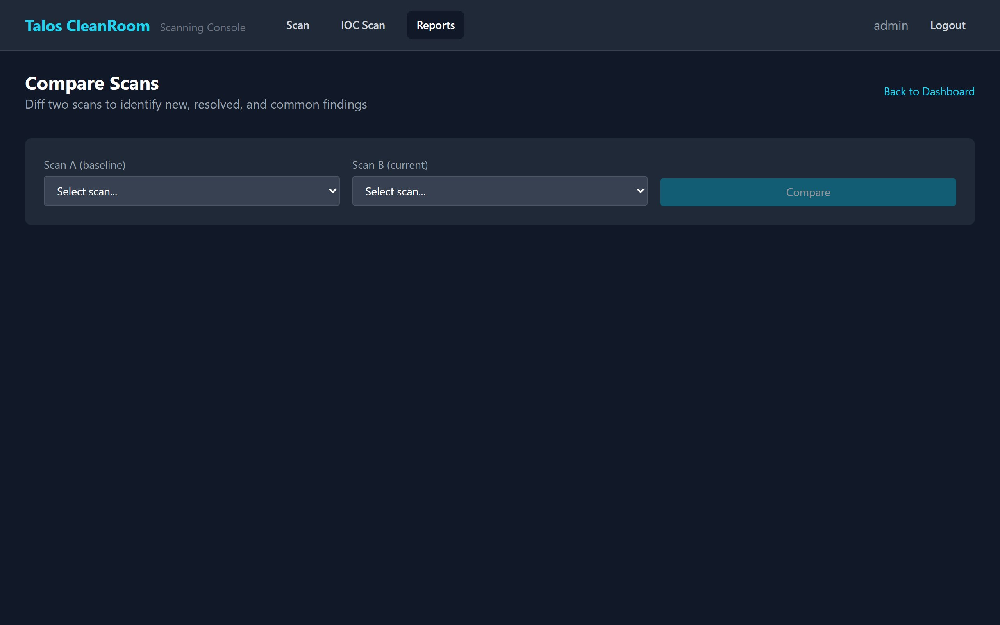

# Comparing Scans

Scan comparison lets you see what changed between two scans — which vulnerabilities were fixed, which are new, and which remain.

## When to Compare

- **After remediation** — compare a baseline scan with a follow-up scan to verify fixes
- **Periodic assessments** — compare monthly scans to track security posture over time
- **Before and after changes** — compare scans before and after a system update or configuration change

## Running a Comparison

1. Go to **Reports** → click **Compare Scans**
2. Select **Scan A** (the baseline/older scan) from the dropdown
3. Select **Scan B** (the current/newer scan) from the dropdown
4. Click **Compare**

{ width="720" }

## Understanding the Results

The comparison shows two sections:

### Hosts

| Category | Meaning |
|---|---|
| **New Hosts** | Hosts found in Scan B but not in Scan A — new devices on the network |
| **Resolved Hosts** | Hosts found in Scan A but not in Scan B — devices that are no longer reachable |
| **Common Hosts** | Hosts found in both scans |

### Vulnerabilities

| Category | Meaning |
|---|---|
| **New Vulnerabilities** | Found in Scan B but not Scan A — new security issues that appeared |
| **Resolved Vulnerabilities** | Found in Scan A but not Scan B — issues that were fixed or are no longer detected |
| **Common Vulnerabilities** | Found in both scans — issues that still exist |

!!! tip "Measuring progress"
    A successful remediation cycle shows many items in the "Resolved" column and few in the "New" column. If you see many new vulnerabilities, it may indicate new software was installed or a scan profile change.

## Best Practices

- **Compare scans with the same target and profile** for the most accurate results. Comparing a Quick scan against a Thorough scan will show many "new" findings that are simply due to the deeper scan, not actual new vulnerabilities.
- **Use consistent naming** for targets (e.g., always use `10.83.3.0/24` rather than switching between IP and hostname).

## What's Next?

- [Vulnerabilities](vulnerabilities.md) — drill into the full vulnerability list
- [Remediation Tracking](../scanning/remediation.md) — update status on findings
- [Exporting Results](../scanning/export.md) — download comparison data
