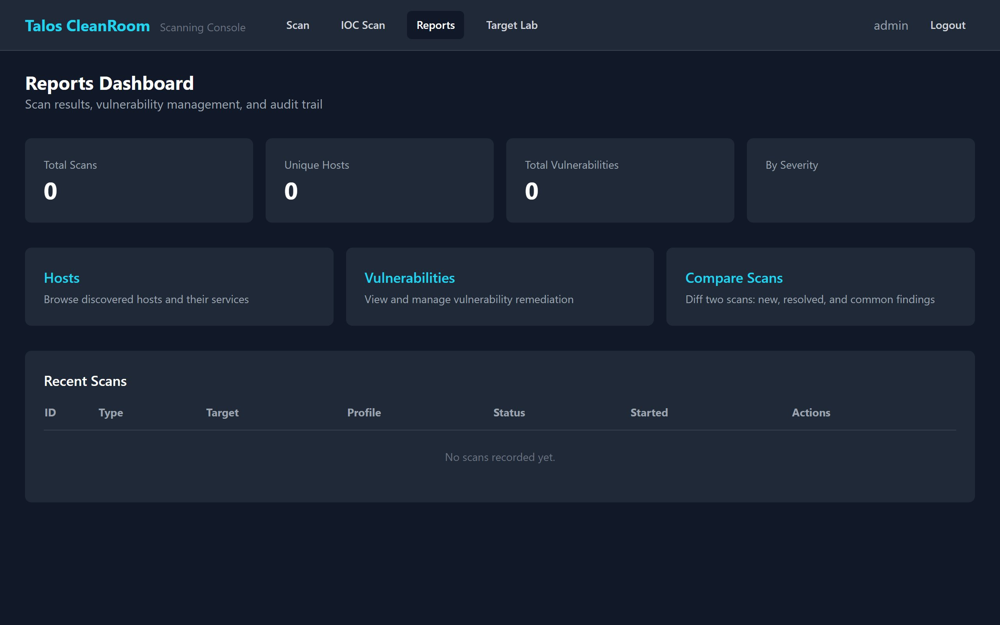

# Reports Dashboard

The Reports Dashboard gives you a high-level overview of all scanning activity and findings.

## Accessing Reports

Click **Reports** in the Scanning Console navigation bar.

{ width="720" }

## Summary Cards

Four cards at the top show aggregate statistics:

| Card | What It Shows |
|---|---|
| **Total Scans** | Number of scans that have been run |
| **Unique Hosts** | Number of distinct hosts discovered across all scans |
| **Total Vulnerabilities** | Total number of vulnerabilities found |
| **By Severity** | Breakdown of vulnerabilities by severity level (Critical, High, Medium, Low, Info) |

## Quick Links

Below the summary cards, quick-access buttons take you to:

- **[Hosts](hosts.md)** — browse all discovered hosts
- **[Vulnerabilities](vulnerabilities.md)** — view and filter all findings
- **[Compare Scans](compare.md)** — compare two scans side-by-side

## Recent Scans

A table lists recent scans with:

| Column | Description |
|---|---|
| **ID** | Unique scan identifier |
| **Type** | Vulnerability scan or IOC scan |
| **Target** | IP address or range that was scanned |
| **Profile** | Scan profile used (Quick, Standard, Thorough, Custom) |
| **Status** | Completed, Failed, Aborted, or Running |
| **Started** | When the scan began |
| **Actions** | Click "View Details" to drill into the scan |

## Video Walkthrough

## What's Next?

- [Scan Details](scan-detail.md) — drill into a specific scan
- [Vulnerabilities](vulnerabilities.md) — filter and sort all findings
- [Comparing Scans](compare.md) — measure remediation progress
