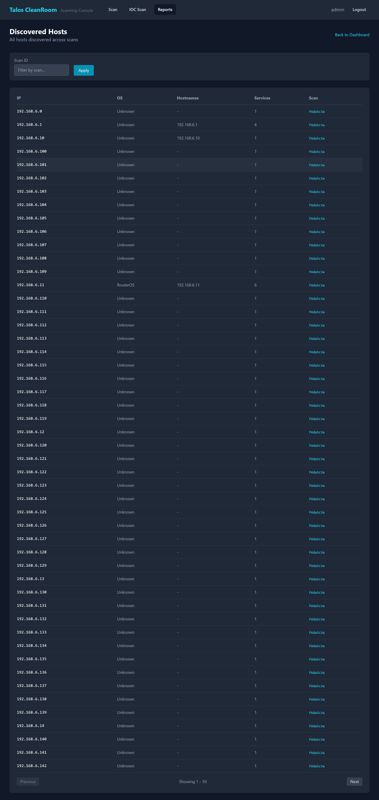

# Hosts

The Hosts page shows all IP addresses discovered across all scans.

## Accessing the Hosts Page

Go to **Reports** → click **Hosts** in the quick links, or navigate directly to the Hosts tab.

{ width="720" }

## Host List

Each row shows:

| Column | Description |
|---|---|
| **IP Address** | The host's IP address |
| **Hostname** | Resolved hostname (if available) |
| **Open Services** | Number of open ports/services discovered |
| **Vulnerabilities** | Total number of vulnerabilities found on this host |
| **Last Seen** | Most recent scan that discovered this host |

## Filtering and Pagination

- Use the **search** box to find a specific IP or hostname
- Results are **paginated** — use Previous/Next to browse large lists

## Drilling Into a Host

Click on any host to see:

- **Services** — all open ports and the software running on them (e.g., "Apache 2.4.52 on port 80")
- **Vulnerabilities** — all findings for this host, with severity, CVE, and remediation status

## What's Next?

- [Vulnerabilities](vulnerabilities.md) — view all findings with advanced filters
- [Scan Details](scan-detail.md) — see results from a specific scan
- [Remediation Tracking](../scanning/remediation.md) — update status on findings
