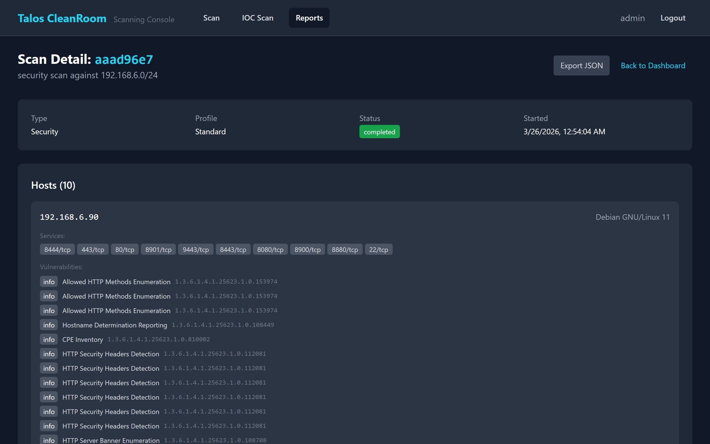

# Scan Details

The Scan Detail page shows everything found by a single scan — hosts, services, vulnerabilities, and IOC findings.

## Accessing a Scan's Details

1. Go to **Reports** in the Scanning Console
2. Click **View Details** on any scan in the recent scans table

{ width="720" }

## What You'll See

### Scan Summary

At the top, key scan metadata:

- **Target** — what was scanned
- **Profile** — which scan profile was used
- **Tools** — which tools ran (Nmap, OpenVAS, Metasploit)
- **Duration** — how long the scan took
- **Status** — whether it completed successfully

### Hosts Discovered

A list of all IP addresses (hosts) that the scan found, with:

- Number of **open services** (ports) per host
- Number of **vulnerabilities** per host
- Click a host to see its services and vulnerabilities in detail

### Vulnerabilities

All vulnerabilities found during this scan, showing:

- **Severity badge** — color-coded (Critical = red, High = orange, Medium = yellow, Low = blue, Info = gray)
- **Name** — vulnerability name (often includes CVE identifier)
- **Host** — which host it was found on
- **Tool** — which scanner found it
- **CVSS/EPSS scores** — if enrichment has completed (see [Enrichment](../scanning/enrichment.md))

### IOC Findings

If this was a combined scan or IOC scan, findings appear here with severity (Alert, Warning, Notice), file paths, and matched rules.

### Faraday Sync Status

Shows whether results were uploaded to Faraday for each tool. A green checkmark means the upload succeeded.

## Exporting

Click **Export JSON** to download the full scan report (hosts, services, vulnerabilities, and IOC findings) as a JSON file.

## What's Next?

- [Hosts](hosts.md) — browse hosts across all scans
- [Vulnerabilities](vulnerabilities.md) — filter all findings
- [Exporting Results](../scanning/export.md) — download as CSV or JSON
