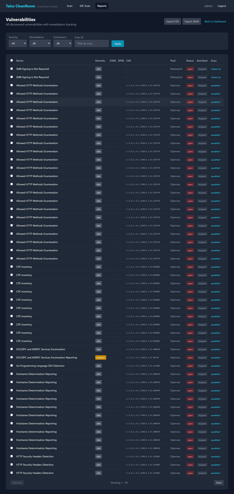

# Vulnerabilities

The Vulnerabilities page is the most powerful view in the Reports section. It lists every vulnerability found across all scans with rich filtering, sorting, and bulk actions.

## Accessing Vulnerabilities

Go to **Reports** → click **Vulnerabilities** in the quick links.

{ width="720" }

## Filters

Narrow down the list using these filters:

| Filter | What It Does |
|---|---|
| **Scan** | Show only vulnerabilities from a specific scan |
| **Severity** | Filter by Critical, High, Medium, Low, or Info |
| **Remediation Status** | Filter by Open, In Progress, Resolved, False Positive, or Accepted |
| **Enrichment Status** | Filter by Enriched, Pending, Skipped, or Failed |
| **Min CVSS** | Show only vulnerabilities with a CVSS score above a threshold (e.g., 7.0 for High+) |
| **Min EPSS** | Show only vulnerabilities with an EPSS exploit probability above a threshold |

## Vulnerability Details

Each vulnerability row shows:

- **Severity badge** — color-coded by severity level
- **Name** — often includes the CVE identifier (e.g., `CVE-2024-1234`)
- **Host** — which IP address it was found on
- **Tool** — which scanner detected it (Nmap, OpenVAS, or Metasploit)
- **CVSS Score** — severity on a 0-10 scale (see [Understanding Results](../reference/understanding-results.md))
- **EPSS** — exploit probability as a percentage
- **Remediation Status** — current tracking status

## Sorting

Click any column header to sort by that column. Common sorts:

- **CVSS Score descending** — most severe first (recommended for triage)
- **EPSS descending** — most likely to be exploited first
- **Host** — group by target system

## Bulk Actions

1. Check the boxes next to multiple vulnerabilities
2. Use the bulk action dropdown to set remediation status on all selected items at once

See [Remediation Tracking](../scanning/remediation.md) for details on the remediation workflow.

## Exporting

Click **Export CSV** or **Export JSON** to download the current filtered view. The export respects all active filters.

See [Exporting Results](../scanning/export.md) for more details.

## What's Next?

- [Remediation Tracking](../scanning/remediation.md) — update status on findings
- [Comparing Scans](compare.md) — see what changed between scans
- [Understanding Results](../reference/understanding-results.md) — interpret CVSS and EPSS scores
