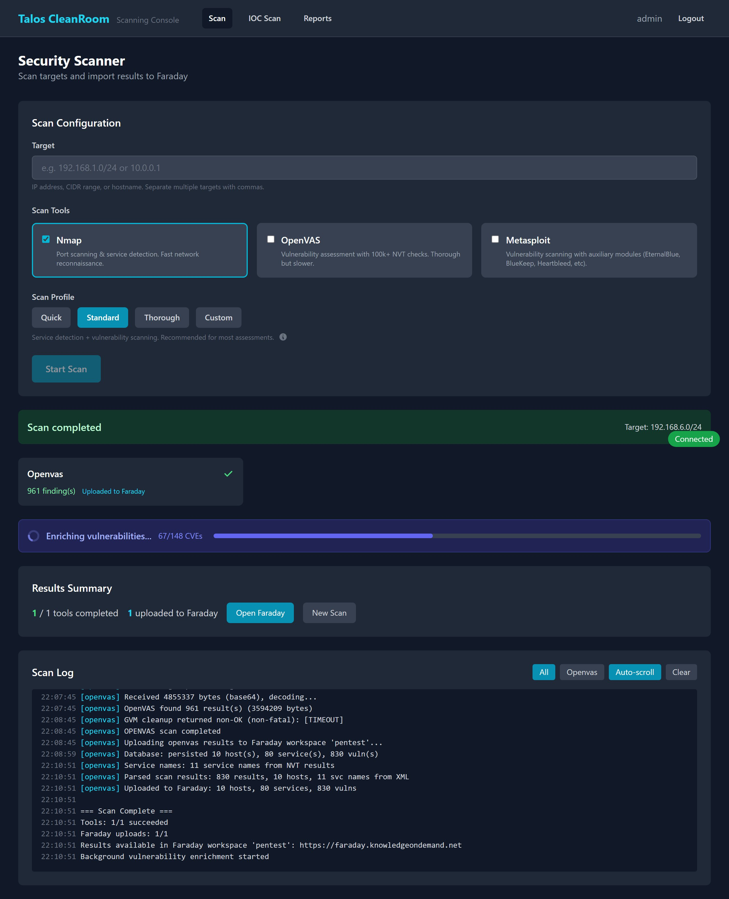

# Enrichment

After a vulnerability scan completes, the system automatically **enriches** each finding with additional data from public security databases. This adds severity scores, exploit probability, and threat intelligence that help you prioritize which vulnerabilities to fix first.

## What Enrichment Adds

| Data | Source | What It Tells You |
|---|---|---|
| **CVSS Score** (0-10) | NVD (National Vulnerability Database) | How severe the vulnerability is. See [Understanding Results](../reference/understanding-results.md) for the severity scale. |
| **EPSS Score** (0-1) | FIRST.org | The probability that this vulnerability will be exploited in the wild in the next 30 days |
| **EPSS Percentile** | FIRST.org | How this vulnerability compares to all other known vulnerabilities (e.g., 95th percentile = more likely to be exploited than 95% of all CVEs) |
| **CWE ID** | NVD | The category of weakness (e.g., "SQL Injection", "Buffer Overflow") |
| **Threat Intelligence** | AlienVault OTX | Whether this vulnerability has been seen in active threat campaigns |

## How Enrichment Works

1. After a scan completes, enrichment starts automatically
2. Each vulnerability with a CVE identifier (e.g., `CVE-2024-1234`) is looked up in public databases
3. A progress bar shows enrichment status:

    { width="720" }

4. Vulnerabilities without a CVE identifier are marked as "skipped" (they cannot be enriched)

## Enrichment Status

Each vulnerability has an enrichment status:

| Status | Meaning |
|---|---|
| **Enriched** | Successfully looked up — CVSS/EPSS data available |
| **Pending** | Waiting to be processed |
| **Skipped** | No CVE identifier — cannot be enriched |
| **Failed** | Lookup failed (network issue or API error) — will be retried |

## Manual Enrichment

If enrichment did not run automatically, or if you want to re-enrich a scan:

- **Trigger enrichment** for a specific scan from its detail page
- **Trigger all** to re-process all pending/failed vulnerabilities

!!! note "Rate limit"
    Enrichment can be triggered up to **2 times per hour** per user. This limit prevents overloading the public databases.

## NVD API Key

Enrichment queries the NVD database, which has a public rate limit. To speed up enrichment:

1. Register for a free NVD API key at [nvd.nist.gov](https://nvd.nist.gov/developers/request-an-api-key)
2. Configure the key in the Scanning Console settings

With an API key, enrichment runs significantly faster (the NVD allows more requests per second).

## What's Next?

- [Understanding Results](../reference/understanding-results.md) — how to interpret CVSS, EPSS, and severity levels
- [Remediation Tracking](remediation.md) — prioritize and track fixes
- [Vulnerabilities Report](../reports/vulnerabilities.md) — filter and sort by enrichment data
