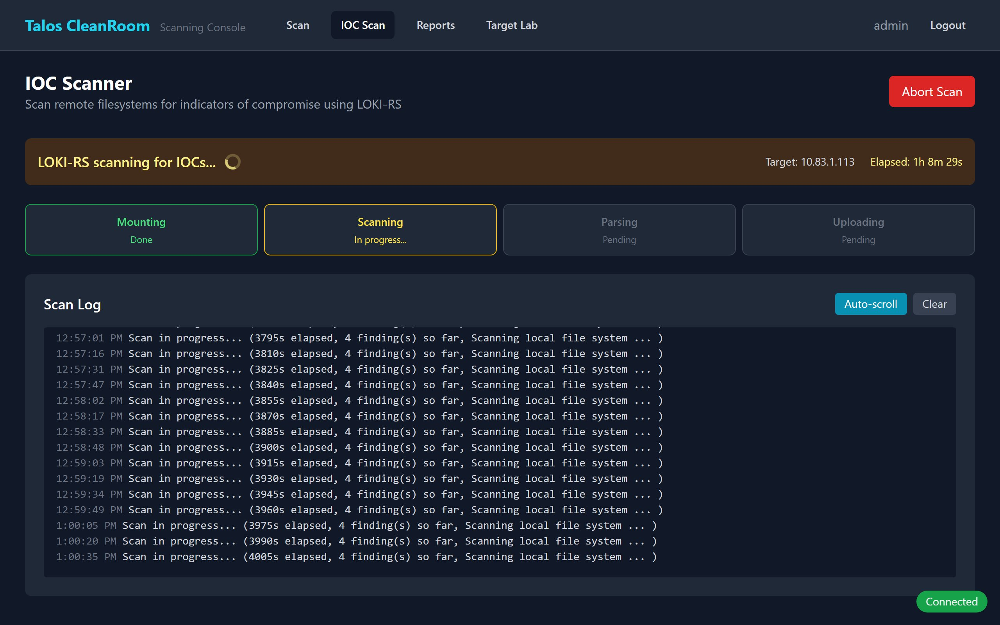
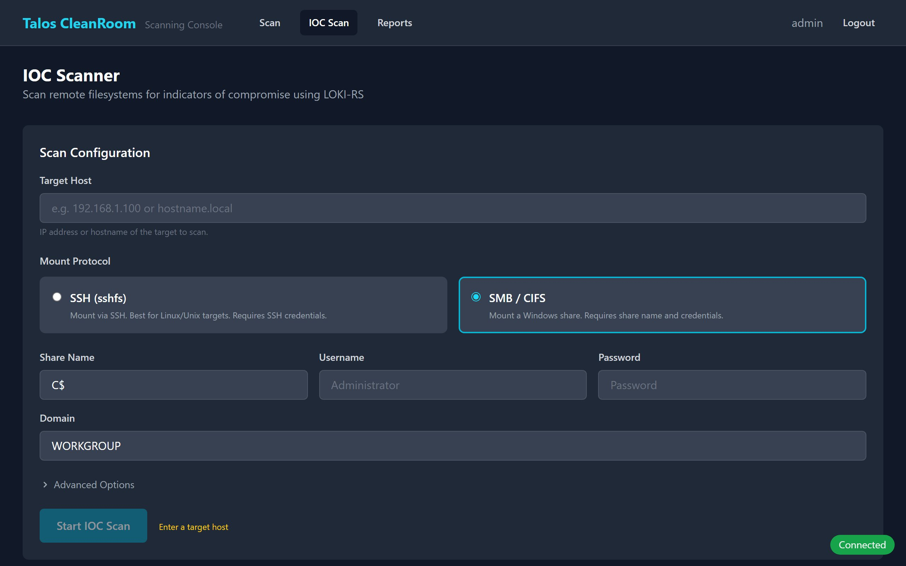
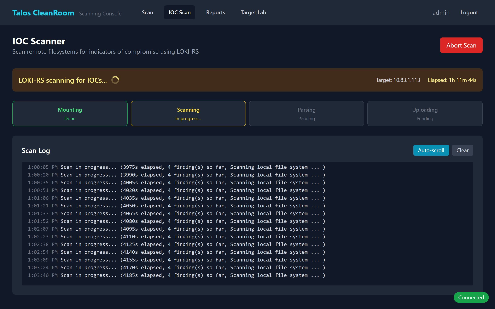
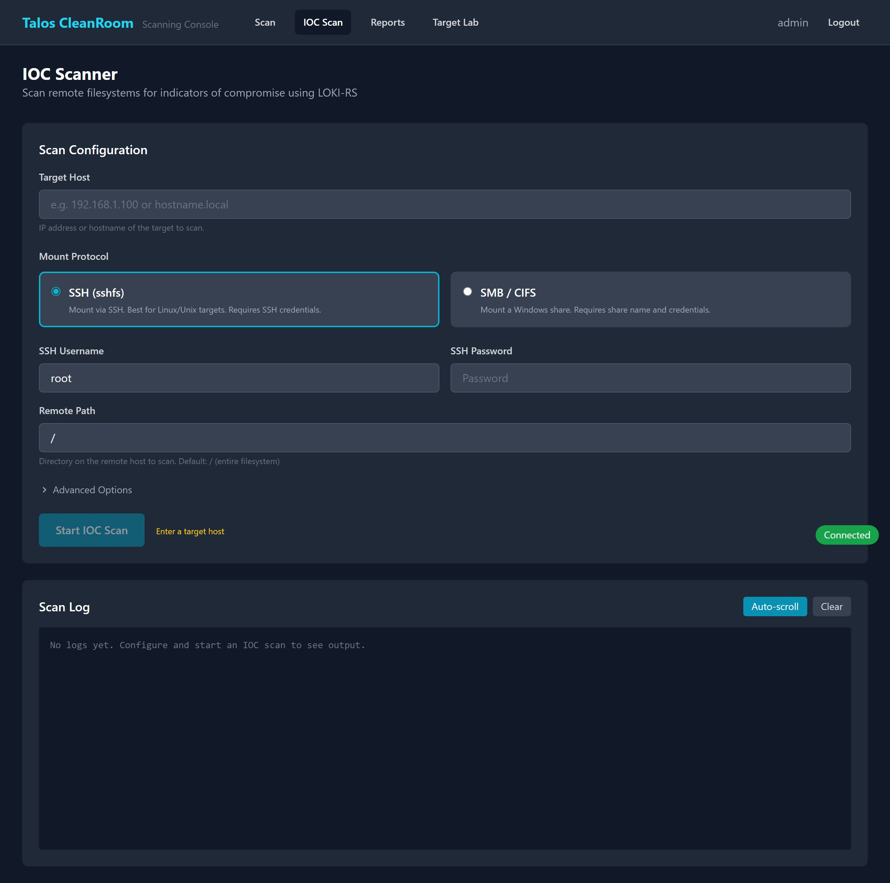

# IOC Scanning

IOC (Indicator of Compromise) scanning checks a remote file system for signs of malware, hacking tools, or other suspicious files. It uses **LOKI-RS**, a scanner that matches files against known threat signatures, malicious file hashes, and YARA rules (patterns that identify malware families).

## When to Use IOC Scanning

- After a suspected breach — check if malware was dropped on a server
- During incident response — find artifacts left by an attacker
- Routine hygiene — periodically check critical servers for threats

## Running an IOC Scan

1. Navigate to the **IOC Scan** tab in the Scanning Console
2. Enter the **target host** — the IP address or hostname of the system to scan
3. Choose the **mount protocol** — how to connect to the target's file system:

=== "SSH (Linux/Unix)"

    Use SSH to connect to Linux or Unix servers.

    { width="720" }

    - **Username** — SSH login user
    - **Password** — SSH password
    - **Remote Path** — directory to scan (e.g., `/home` or `/var`)

=== "SMB (Windows)"

    Use SMB (Windows file sharing) to connect to Windows servers.

    { width="720" }

    - **Share Name** — the Windows share to mount (e.g., `C$`)
    - **Username** — Windows login user
    - **Password** — Windows password
    - **Domain** — Windows domain (optional)

4. **Ensure the target allows inbound connections** from the Kubernetes worker subnet:

    === "Windows (SMB — port 445)"

        The scanner connects via SMB from the Kubernetes workers (`10.83.3.0/24`). If Windows Firewall is blocking port 445, the mount will fail with `Operation now in progress`. Open an **elevated PowerShell** and run:

        ```powershell
        New-NetFirewallRule -DisplayName "Allow SMB from K8s VLAN" `
            -Direction Inbound -Protocol TCP -LocalPort 445 `
            -RemoteAddress 10.83.3.0/24 -Action Allow
        ```

    === "Linux (SSH — port 22)"

        The scanner connects via SSH from the Kubernetes workers (`10.83.3.0/24`). If `iptables` or `ufw` is blocking port 22, allow it:

        **Using ufw:**
        ```bash
        sudo ufw allow from 10.83.3.0/24 to any port 22 proto tcp
        ```

        **Using iptables:**
        ```bash
        sudo iptables -A INPUT -p tcp --dport 22 -s 10.83.3.0/24 -j ACCEPT
        ```

    !!! tip "Scope the rule to the K8s subnet"
        The examples above only allow access from `10.83.3.0/24` (the Kubernetes VLAN), not from all networks. Adjust the subnet if your cluster uses a different IP range.

5. Optionally expand **Advanced Options**:
    - **Max file size** — skip files larger than this (default: 100 MB)
    - **Scan archives** — check inside ZIP/TAR files

6. Click **Start IOC Scan**

!!! note "Credentials are transmitted securely"
    Your SSH or SMB credentials are sent over an encrypted HTTPS connection and are not stored after the scan completes.

## Monitoring Progress

The scan progresses through four phases:

1. **Prepare** — creating the scanner environment
2. **Mount** — connecting to the target file system
3. **Scan** — checking files against threat signatures
4. **Cleanup** — disconnecting and removing temporary resources

{ width="720" }

## Understanding Findings

When the scan completes, findings are displayed in a summary and table:

{ width="720" }

### Severity Levels

| Severity | Color | Score | Meaning |
|---|---|---|---|
| **Alert** | Red | 80-100 | High confidence match — likely malware or hacking tool. Investigate immediately. |
| **Warning** | Yellow | 60-79 | Suspicious file — may be legitimate but warrants review |
| **Notice** | Cyan | Below 60 | Low confidence — informational, usually benign |

### Finding Details

Click on any finding row to expand it and see:

- **File path** on the target system
- **MD5 and SHA256 hashes** — unique fingerprints of the file
- **Matched rule** — which threat signature triggered the detection
- **Matched strings** — specific patterns found in the file
- **Tags** — categorization (e.g., malware family, tool name)

## Scan History

Previous IOC scans are listed at the bottom of the page, showing target, protocol, status, and findings count.

## What's Next?

- [Remediation Tracking](remediation.md) — track actions taken on findings
- [Target Lab](target-lab.md) — deploy vulnerable test targets
- [Reports Dashboard](../reports/dashboard.md) — view all scan results
- [Exporting Results](export.md) — download findings as CSV or JSON
