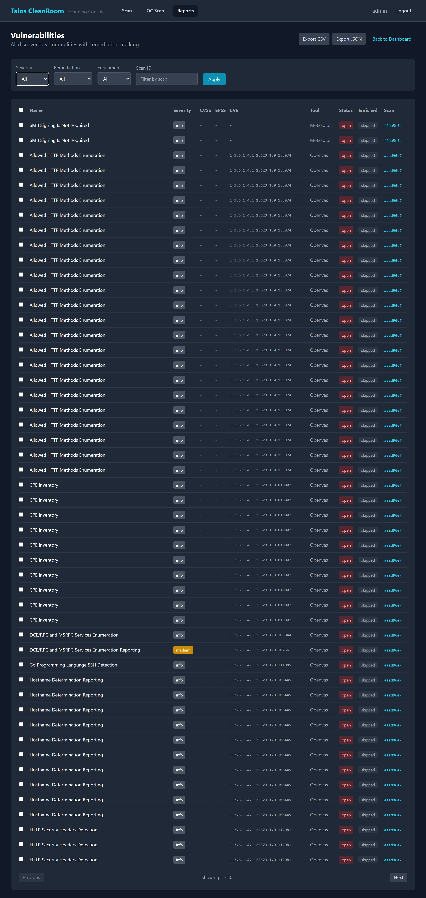

# Remediation Tracking

After scanning, you need to decide what to do about each finding. The Scanning Console lets you track the remediation status of every vulnerability and IOC finding.

## Remediation Statuses

Each vulnerability can be assigned one of these statuses:

| Status | When to Use |
|---|---|
| **Open** | Default — the vulnerability has been found but no action taken yet |
| **In Progress** | Someone is actively working on a fix |
| **Resolved** | The vulnerability has been fixed or patched |
| **False Positive** | The finding is incorrect — the vulnerability does not actually exist |
| **Accepted** | The risk is acknowledged but will not be fixed (e.g., low risk, mitigating controls in place) |

## Updating a Single Vulnerability

1. Go to **Reports** → **Vulnerabilities**
2. Find the vulnerability you want to update
3. Click the **remediation dropdown** next to it
4. Select the new status
5. Optionally add **notes** explaining what was done (e.g., "Patched in update KB5012345")

{ width="720" }

## Bulk Remediation

To update multiple vulnerabilities at once:

1. Go to **Reports** → **Vulnerabilities**
2. Check the boxes next to the vulnerabilities you want to update
3. Use the **bulk action** dropdown at the top
4. Select the new status
5. All selected vulnerabilities will be updated

!!! tip "Common bulk workflows"
    - After patching a server: filter by host, select all resolved vulns, mark as "Resolved"
    - After reviewing false positives: filter by specific vulnerability name, mark all as "False Positive"
    - Accepting low-risk findings: filter by severity "Info" or "Low", mark as "Accepted"

## Tracking Progress Over Time

Use the [Compare Scans](../reports/compare.md) feature to measure remediation progress:

1. Run a baseline scan
2. Remediate the findings
3. Run a follow-up scan with the same target and profile
4. Compare the two scans to see which vulnerabilities are **resolved** (gone) and which are **new**

## What's Next?

- [Vulnerabilities Report](../reports/vulnerabilities.md) — filter and sort all findings
- [Comparing Scans](../reports/compare.md) — measure remediation progress
- [Exporting Results](export.md) — download data for reporting
