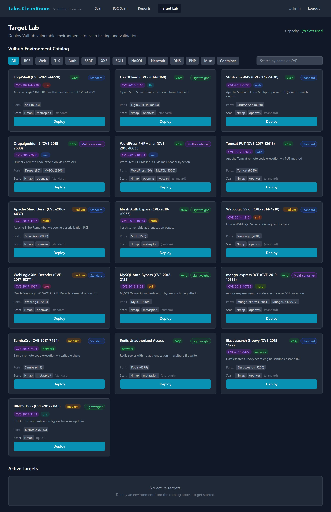
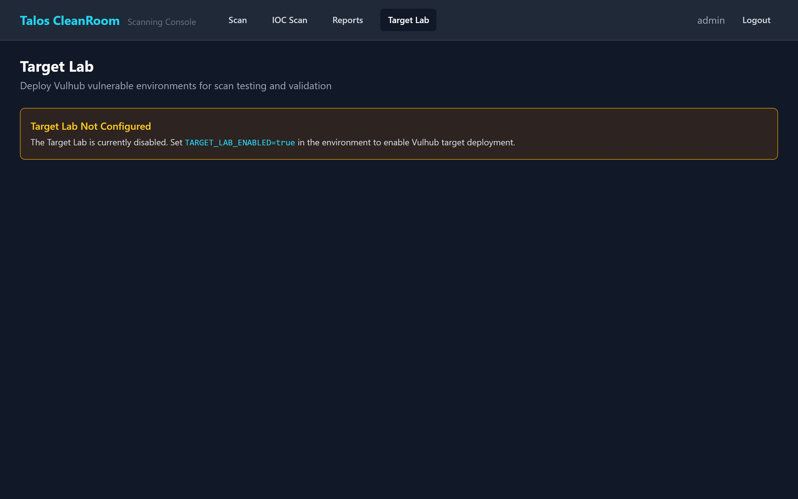

# Target Lab

The Target Lab lets you deploy **Vulhub vulnerable environments** directly into your Kubernetes cluster for scan testing and validation. Each environment is a pre-built, intentionally vulnerable application that you can scan with the Scanning Console to practice or verify detection coverage.

## When to Use Target Lab

- **Testing scan profiles** — validate that Quick, Standard, or Thorough profiles detect known vulnerabilities
- **Training** — practice running scans and interpreting results against known targets
- **Verifying tool coverage** — confirm that Nmap, OpenVAS, Metasploit, and WPScan detect the CVEs in each environment

## Browsing the Catalog

Navigate to the **Target Lab** tab in the Scanning Console.

{ width="720" }

The catalog displays available environments as cards. Each card shows:

| Field | Description |
|---|---|
| **Name** | Environment name and vulnerability description |
| **CVE** | The CVE identifier for the vulnerability |
| **Category** | Type of vulnerability (web, rce, database, etc.) |
| **Difficulty** | Easy, Medium, or Hard |
| **Tier** | Resource tier — Lightweight, Standard, or Multi-container |
| **Ports** | Network ports exposed by the environment |
| **Recommended Scan** | Suggested tools and profile for detecting this CVE |

### Filtering

- Click **category tabs** at the top to filter by vulnerability type (All, Web, RCE, Database, etc.)
- Use the **search box** to find environments by name or CVE number

## Deploying a Target

1. Find an environment in the catalog
2. Click **Deploy** on the card
3. A spinner indicates the environment is being created

The environment deploys as Kubernetes pods in a dedicated namespace. Deployment typically takes 30-60 seconds depending on the tier.

!!! note "Capacity limits"
    The capacity indicator in the top-right shows how many slots are in use (e.g., "2/5 slots used"). You cannot deploy new targets when at capacity — destroy an existing target first.

## Managing Active Targets

Below the catalog, the **Active Targets** table shows all deployed environments:

{ width="720" }

| Column | Description |
|---|---|
| **Name** | Environment name |
| **CVE** | CVE identifier |
| **Category** | Vulnerability category |
| **Endpoint** | IP and port to use as the scan target |
| **Status** | Deploying, Running, Error, or Destroying |
| **TTL Remaining** | Time until automatic cleanup (default: 2 hours) |
| **Actions** | Logs, Scan, +2h, Destroy |

### Actions

| Button | What It Does |
|---|---|
| **Logs** | Expand the deployment log panel to see pod creation progress |
| **Scan** | Navigate to the Scan page with the target endpoint pre-filled and recommended tools/profile selected |
| **+2h** | Extend the time-to-live by 2 hours |
| **Destroy** | Tear down the environment and free the slot |

### Deployment Logs

Click **Logs** on a deploying or running target to expand the log panel:

{ width="720" }

## Scanning a Target

The fastest way to scan a deployed target:

1. Click the **Scan** button on a running target
2. The Scan page opens with the **target endpoint** pre-filled
3. The **recommended tools and profile** are pre-selected based on the environment's metadata
4. Click **Start Scan**

You can also manually enter the target's endpoint IP:port on the Scan page.

## Target Lab Not Configured

If the Target Lab feature is disabled, you will see a warning banner:

> **Target Lab Not Configured** — Set `TARGET_LAB_ENABLED=true` in the environment to enable Vulhub target deployment.

Contact your administrator to enable this feature.

## Video Walkthrough

Video 3 shows the full Target Lab workflow — deploying a target, then scanning it:

## What's Next?

- [Vulnerability Scanning](vulnerability-scan.md) — run a scan against a deployed target
- [Scan Profiles Reference](../reference/scan-profiles.md) — understand what each profile tests
- [Reports Dashboard](../reports/dashboard.md) — view scan results from target lab scans
