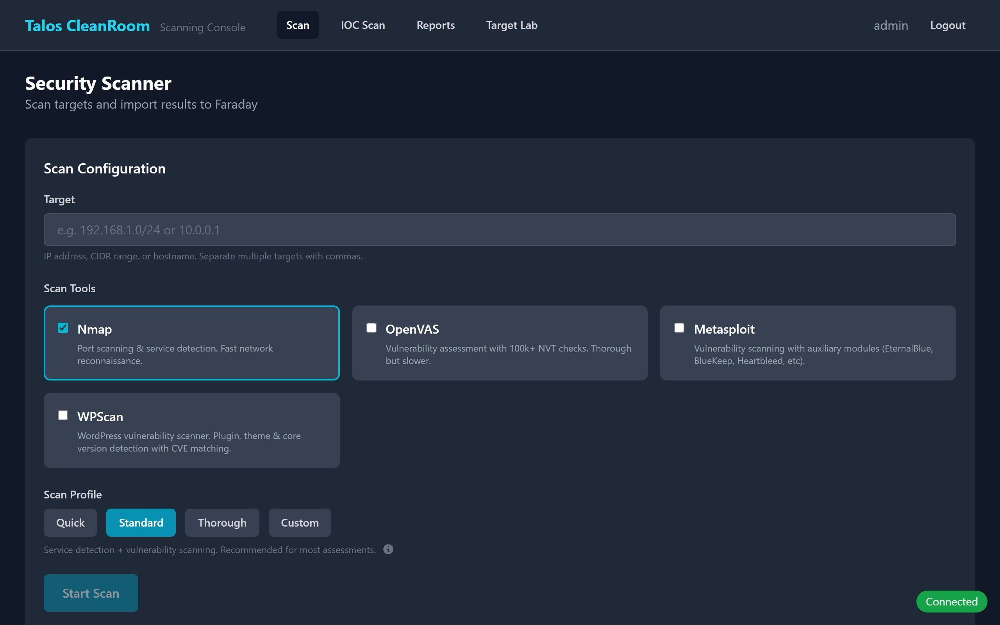
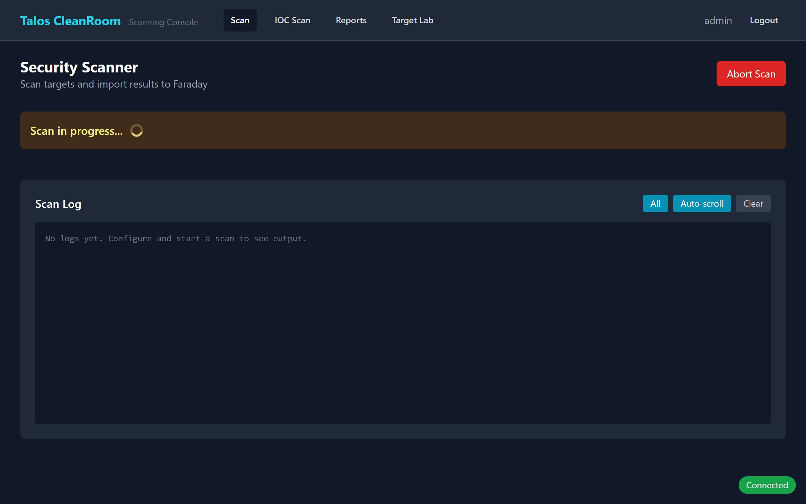
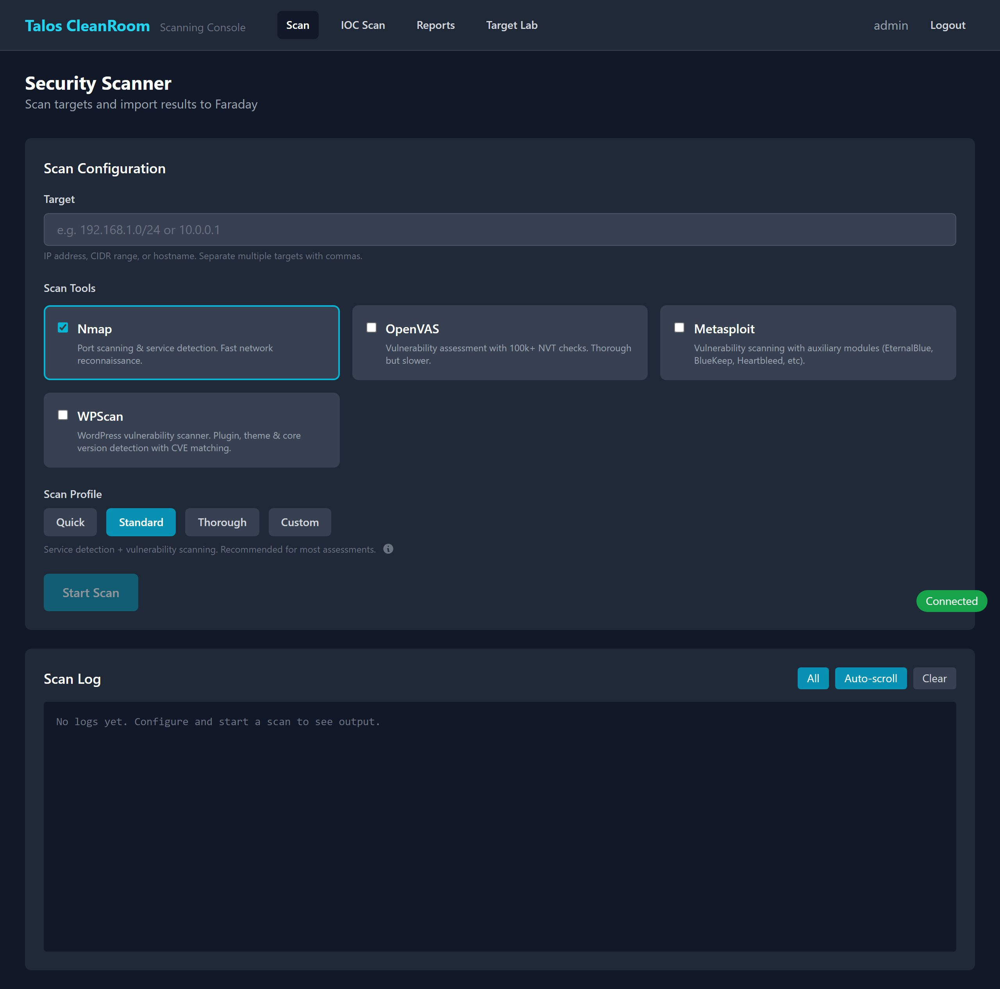
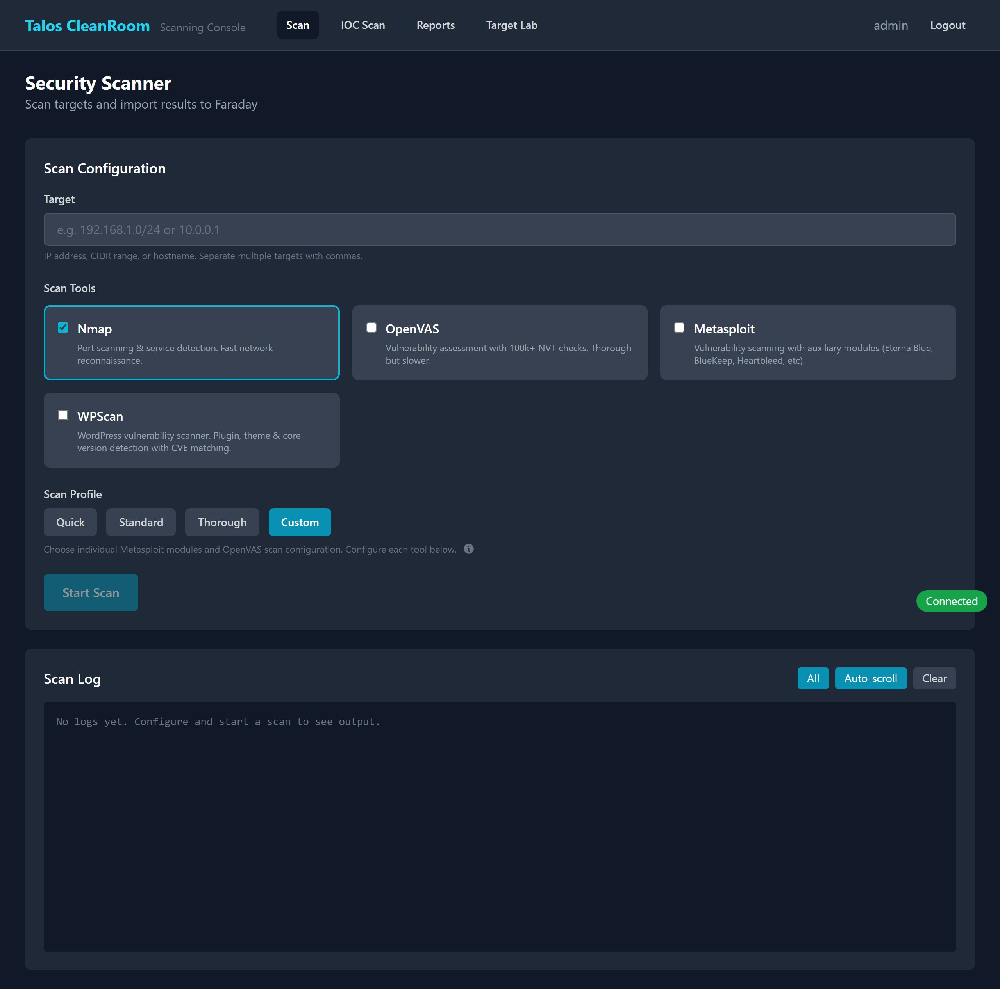

# Vulnerability Scanning

Vulnerability scanning checks your network for security weaknesses. The Scanning Console uses four professional tools — **Nmap**, **OpenVAS**, **Metasploit**, and **WPScan** — and combines their results into a single view.

## Quick Start: Running Your First Scan

1. Navigate to the **Scan** tab in the Scanning Console
2. Enter your **target** — an IP address (e.g., `10.83.3.10`), a range (e.g., `10.83.3.0/24`), or a hostname

    { width="720" }

3. **Select tools** by checking the boxes:
    - **Nmap** — fast port and service discovery
    - **OpenVAS** — deep vulnerability detection using thousands of test scripts
    - **Metasploit** — exploit-based vulnerability verification
    - **WPScan** — WordPress-specific vulnerability scanner (plugins, themes, core versions)
4. **Choose a profile** — click one of the four buttons:

    | Profile | Speed | Best For |
    |---|---|---|
    | **Quick** | ~5-15 min (Nmap) / ~2 hrs (with OpenVAS) | Fast check, top 100 ports only |
    | **Standard** | ~2-8 hours | Regular assessments with good coverage |
    | **Thorough** | ~4-14 hours | Comprehensive audit, all ports and deep checks |
    | **Custom** | Varies | Advanced users who want to pick specific modules |

    See [Scan Profiles Reference](../reference/scan-profiles.md) for full details on what each profile does.

5. Click **Start Scan**

!!! note "One scan at a time"
    Only one vulnerability scan can run at a time. If a scan is already in progress, you will see a "Scan already in progress" message.

## Monitoring a Running Scan

Once started, the page shows real-time progress:

{ width="720" }

### Tool Progress Cards

Each selected tool gets its own card showing:

- **Status** — Idle, Running, Completed, or Failed
- **Findings count** — how many vulnerabilities were found
- **Faraday upload** — whether results were sent to the Faraday vulnerability manager

### Log Stream

Below the progress cards, a live log stream shows detailed output from each tool. Use the **filter buttons** (All, Nmap, OpenVAS, Metasploit, WPScan) to focus on a specific tool's output.

## After a Scan Completes

When all tools finish:

{ width="720" }

- A **results summary** shows the total findings per tool
- [Enrichment](enrichment.md) runs automatically to add severity scores and exploit probability data
- Click **Open Faraday** to view findings in the vulnerability management platform
- Click **New Scan** to run another scan

## Advanced: Custom Profile

When you select the **Custom** profile, additional options appear:

{ width="720" }

- **Metasploit Module Picker** — select individual exploit and scanner modules from categorized lists
- **OpenVAS Configuration** — choose a specific scan config or select individual NVT (Network Vulnerability Test) families

## Scan History

At the bottom of the Scan page, a history table shows all previous scans with their target, profile, status, and timestamp. Click a scan to view its detailed results in the [Reports section](../reports/scan-detail.md).

## Video Walkthrough

## What's Next?

- [Enrichment](enrichment.md) — understand the CVSS/EPSS data added to your findings
- [IOC Scanning](ioc-scan.md) — check file systems for malware indicators
- [Target Lab](target-lab.md) — deploy vulnerable test targets to scan
- [Reports Dashboard](../reports/dashboard.md) — view and compare scan results
- [Scan Profiles Reference](../reference/scan-profiles.md) — full details on each profile
